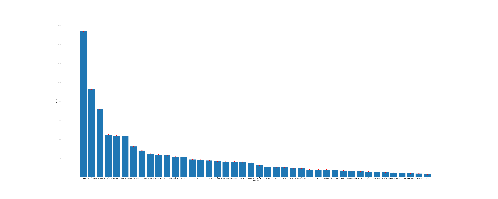
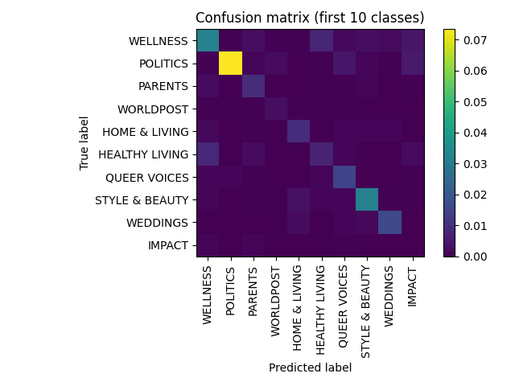

# News Classification

## Data
### Preprocessing
The data processing consists of two steps:

- deleting rows with empty cells in the *headline* or *short_description* columns,
- creating a column with the content of the *headline* and *short_description* cells, called *full_text*.

See [`preprocessing.py`](scripts/preprocessing.py).

### Class Imbalance
The dataset consists of 42 class with a very imbalanced distribution. This is a problem for classifiers since it can lead to overfitting on the majority classes. The distribution of the classes can be seen here:

A common practice for dealing with class imbalance is Synthetic Minority Oversampling Technique [SMOTE](https://arxiv.org/abs/1106.1813), a technique that synthesizes new samples of the minority class and adds them to the dataset to balance it out. However, I don't know if this technique can also be used for NLP-related tasks, so I looked into two simpler options:

- **oversampling**, i.e. sampling samples from the minority class(es) more than once per epoch to match the number of samples in the majority class,
- **undersampling**, i.e. sampling less samples from the majority class(es) to match the amount of samples in the minority class.

Since oversampling would lead to too many samples (i.e. training would  take too long) and undersampling would lead to too few samples (model would not get enough information to learn something meaningful), I opted for a combination of the two, making sure that the number of samples is equal to the size of the dataset. For the implementation I used the *WeightedRandomSampler* from the PyTorch library (see [`dataset.py`](scripts/dataset.py)).

### Text Pipeline
For the text pipeline we use the [TorchText](https://pytorch.org/text/stable/index.html) library and it consists of two parts:

1) **Vocabulary**
   - Build the vocabulary using the training data and the *build_vocab_from_iterator* function.
   - Unknown tokens are represented by '<*unk*>'.
2) **Tokenizing**
   -  I used the *basic_english* tokenizer from the *torchtext* library. It turns the text into a list of tokens (in this case, each word is one token).
  

When text is sampled, it is tokenized and then we lookup the index of that token in the vocabulary.

I followed the [Pytorch Tutorial](https://pytorch.org/tutorials/beginner/text_sentiment_ngrams_tutorial.html) for this part.

## Model
For the model, I also followed the same [Pytorch Tutorial](https://pytorch.org/tutorials/beginner/text_sentiment_ngrams_tutorial.html) as mentioned above. It contains an **embedding**, that embeds the tokenized text in a lower dimension and a **linear layer** that projects the embedding to the number of classes.

The model was kept small and simple to be able to run on my local machine (MacOS).

See [`model.py`](scripts/model.py).

## Training
The training pipeline is kept very simple with the following main components/parameters:

- SGD with relatively high learning rate as an optimizer
- training for 50 epoch with batch size 32
- Cross-entropy loss

See [`train.py`](scripts/train.py)

## Results
The model was trained for 50 epochs and achieved a training accuracy of 85%. After that the model was evaluated on the evaluation dataset and achieved an accuracy of 35.7%. The f1 scores, precision and recall values per class are shown below:

|     | class          | f1   | recall | precision |
| --- | -------------- | ---- | ------ | --------- |
| 0   | WELLNESS       | 0.41 | 0.38   | 0.44      |
| 1   | POLITICS       | 0.61 | 0.49   | 0.8       |
| 2   | PARENTS        | 0.29 | 0.37   | 0.24      |
| 3   | WORLDPOST      | 0.26 | 0.31   | 0.22      |
| 4   | HOME & LIVING  | 0.38 | 0.42   | 0.34      |
| 5   | HEALTHY LIVING | 0.23 | 0.25   | 0.22      |
| 6   | QUEER VOICES   | 0.37 | 0.54   | 0.28      |
| 7   | STYLE & BEAUTY | 0.58 | 0.57   | 0.58      |
| 8   | WEDDINGS       | 0.56 | 0.6    | 0.53      |
| 9   | IMPACT         | 0.0  | 0.0    | 0.0       |
| 10  | FOOD & DRINK   | 0.46 | 0.4    | 0.53      |
| 11  | COMEDY         | 0.25 | 0.27   | 0.22      |
| 12  | PARENTING      | 0.29 | 0.26   | 0.32      |
| 13  | ENTERTAINMENT  | 0.37 | 0.31   | 0.45      |
| 14  | ENVIRONMENT    | 0.0  | 0.0    | 0.0       |
| 15  | WORLD NEWS     | 0.22 | 0.32   | 0.16      |
| 16  | COLLEGE        | 0.13 | 0.12   | 0.14      |
| 17  | TECH           | 0.26 | 0.26   | 0.26      |
| 18  | DIVORCE        | 0.55 | 0.55   | 0.55      |
| 19  | RELIGION       | 0.14 | 0.12   | 0.15      |
| 20  | THE WORLDPOST  | 0.24 | 0.26   | 0.21      |
| 21  | WOMEN          | 0.28 | 0.29   | 0.27      |
| 22  | MONEY          | 0.33 | 0.47   | 0.25      |
| 23  | ARTS & CULTURE | 0.0  | 0.0    | 0.0       |
| 24  | BLACK VOICES   | 0.26 | 0.29   | 0.24      |
| 25  | TRAVEL         | 0.43 | 0.4    | 0.46      |
| 26  | GOOD NEWS      | 0.15 | 0.13   | 0.17      |
| 27  | SCIENCE        | 0.27 | 0.3    | 0.24      |
| 28  | BUSINESS       | 0.19 | 0.14   | 0.27      |
| 29  | ARTS           | 0.0  | 0.0    | 0.0       |
| 30  | SPORTS         | 0.29 | 0.58   | 0.2       |
| 31  | WEIRD NEWS     | 0.0  | 0.0    | 0.0       |
| 32  | MEDIA          | 0.35 | 0.31   | 0.39      |
| 33  | CRIME          | 0.42 | 0.38   | 0.46      |
| 34  | EDUCATION      | 0.34 | 0.38   | 0.31      |
| 35  | LATINO VOICES  | 0.12 | 0.1    | 0.17      |
| 36  | TASTE          | 0.21 | 0.24   | 0.19      |
| 37  | GREEN          | 0.1  | 0.11   | 0.1       |
| 38  | STYLE          | 0.19 | 0.17   | 0.23      |
| 39  | U.S. NEWS      | 0.12 | 0.11   | 0.15      |
| 40  | CULTURE & ARTS | 0.0  | 0.0    | 0.0       |
| 41  | FIFTY          | 0.05 | 0.12   | 0.03      |

Additionlly, I plotted the normalized confusion matrix for all classes
the first ten classes:

Finally, the results on the test dataset can be found in the [results file](outputs/testing/test_results.jsonl).

## How to run
1) Create a virtual environment and install the requirements:

        python -m venv venv
        source activate venv/bin/activate
        pip install -r requirements.txt

2) First run preprocessing with:

        python main.py --mode preprocess

This will save the preprocessed data in separate JSONL files with the suffix *_prep*.

3) Run training:
   
        python main.py --mode train

This may take a while... If you get problems with memory, try reducing the batch size in the [config.yaml](config/config.yaml). Once the training is done, the model weights are stored in an ouputs folder under the filename specified as an input argument *--model_file*.

Default input arguments for main.py\
*--config*: 'config/config.yaml'\
*--model_file*: 'model.pth'

4) Evaluate on the evaluation set:

Before running the script, make sure that the path

        python main.py --mode eval

This will save the results in the same output folder. The f1 scores, precision and recall values are stored in CSV format and the confusion matrices in PDF format(see [evaluation outputs](outputs/evaluation)).

5) Finally, run the classification on the test set:

        python main.py --mode classify

The prediction are stored in the same dataframe as the input data but with the column *predicted_category* containing the model's predictions. The dataframe is saved as a JSONL file to the (output folder)[outputs/testing].

## Notes
- To improve training and enable hyperparameter tuning, I would implement stratified k-fold cross-validation next.
- To facilitate the training process, I would use wandb or tensorboard to log and visualize metrics during training.
- The model's performance is not great, but training for more epochs might help. Otherwise altering the model (e.g. embedding dimension, depth, etc.) could improve the results.
